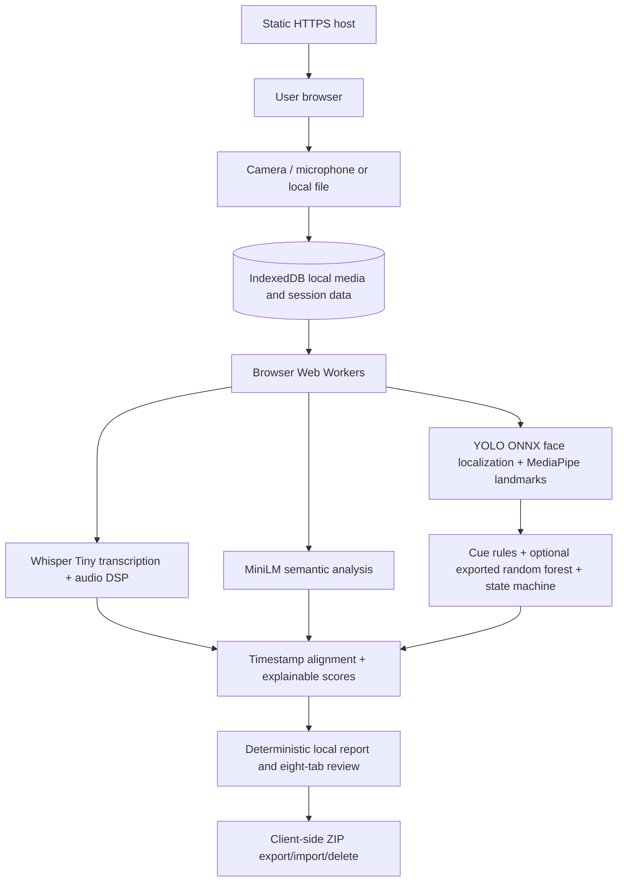

# TalonCV public production architecture

The host serves application code and public model files only. During normal analysis it receives no interview recording, audio, frame, transcript, evidence, score, or report. There is no public backend worker, database, authentication system, queue, inference API, or required secret.

WebAssembly/CPU is the baseline. WebGPU is an optional acceleration choice. Static model downloads are cached by the model runtime and browser cache; local recording/session data is persisted separately in IndexedDB.

The Python/Streamlit pipeline is a research/reference implementation, not a public production dependency.
